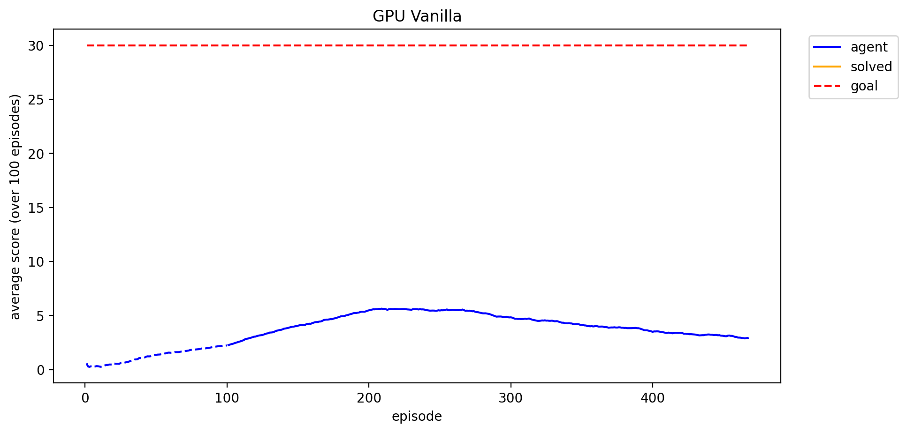
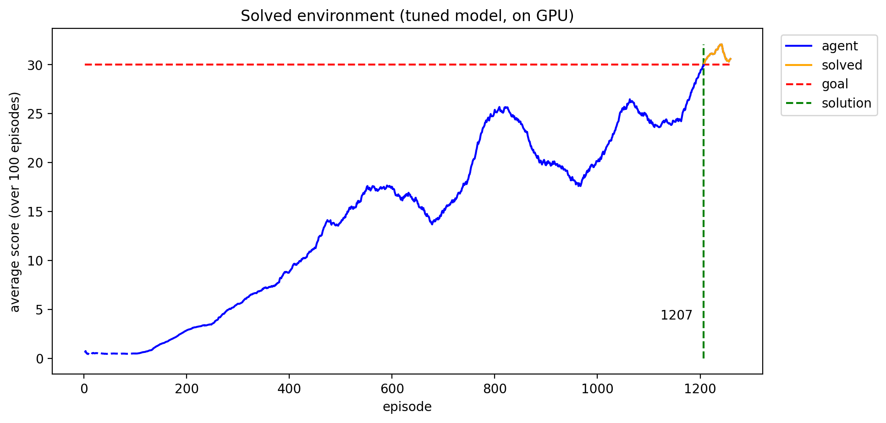

# Unity Reacher - Continuous Control

Training agents using deep reinforcement learning for the reacher environment from the [Unity Machine Learning Agents Toolkit](https://github.com/Unity-Technologies/ml-agents/blob/master/docs/Learning-Environment-Examples.md#reacher).

In this environment, a double-jointed arm can move to target locations. A positive reward is provided for each step that the agent's hand is in the goal location. Thus, the goal of your agent is to maintain its position at the target location for as many time steps as possible.

## Learning task

Attribute | Description
--- | ---
Goal | Keep the agent's hand in the goal location for as long as possible.
Goal (RL) | Maximize expected cumulative reward.
States | `Box(33)`, 33 continuous variables for position, rotation, velocity and angular velocity of the arm and target location.
Actions | `Box(4)` torque applications to each of the two joints (values between -1 and +1)
Rewards | +0.1 for each time step that the agent's hand is in the goal location.

There are two different versions of the environment, detailed in the following.

### Environment versions

This repository contains two separate versions of the Unity environment:
- The first version contains a single agent.
- The second version contains 20 identical agents, each with its own copy of the environment.  

The second version is useful for algorithms like [PPO](https://arxiv.org/pdf/1707.06347.pdf), [A3C](https://arxiv.org/pdf/1602.01783.pdf), and [D4PG](https://openreview.net/pdf?id=SyZipzbCb) that use multiple (non-interacting, parallel) copies of the same agent to distribute the task of gathering experience.  

**Option 1: Solve the First Version.** The task is episodic, and in order to solve the environment, the agent must get an average score of +30 over 100 consecutive episodes.

**Option 2: Solve the Second Version.** The barrier for solving the second version of the environment is slightly different, to take into account the presence of many agents. In particular, the agents must get an average score of +30 (over 100 consecutive episodes, and *averaged* over all agents).

## Training instructions

Follow the code in [`script.py`](./script.py) to see how an agent can be trained.

## Experiments

The DDPG is notoriously difficult to train because it is quite unstable with respect to its hyperparameters. In fact, I found that the same set of hyperparameters would perform _very_ differently using different random seeds. A few failed attempts at learning can be seen in the plots in the [`assets`](./assets) folder. 

Finally, what ended up working well was the following configuration:

Hyperparameter | Value
--- | ---
Network layers | Two hidden layers using ReLU, 256x128. Tanh in the output layer.
Buffer size | 1e5
Batch size | 512
LR for actor | 1e-3
LR for critic | 1e-3
Gamma | 0.99
Tau | 1e-3
Noise mean | 0.0
Noise sigma | 0.2
Noise theta | 0.15
Noise decay | 0.998
Noise min. mean | 0.01
Weight decay actor | 0.0
Weight decay critic | 0.0
Soft update freq. | 5
Hard update freq. | None
Gradient clipping | False

Where `gamma` is the discounting factor, `tau` is the interpolation parameter for the soft updates (as described in the original DDPG paper by Lillicrap et. al [2015]), the noise added to the actions is an Ornstein-Uhlenbeck process using the mean `noise_mu`, standard deviation `noise_sigma` and theta `noise_theta`. The weight decay is a standard L2 weight decay in the networks (which I did not find useful so it is set to 0.0). 

The network is updated softly every `soft_update_freq` time steps. I also implemented a _hard_ update at each time step `t` in an episode which just copies the network weights from the target into the local one. However, I did not use any hard updates (`hard_update_at_t` set to -1). 

Lastly, one can also implement gradient clipping (unit gradients), add batch normalization into the network's first hidden layer.

I found that the network is very unstable, even late during training and one reason for that may be the constant exploration-exploitation strategy which is handled by the noise process. In order to reduce exploration later in training, I introduced a noise decay; after each episode, the `noise_sigma` parameter is multiplied with a `noise_decay` factor. To keep the network from not exploring at all, I also set a minimum value `noise_min_sigma`.

The last addition is a pre-training of the critic, while keeping the actor weights fixed. From the (limited number of) experiments that I ran, I found this helped training in the beginning.

The final agent training can be seen in the training plot below:

## Further Work

The network can obviously be improved by running a more extensive random/grid search for optimizing the hyperparameters. 

Another suggestion would be to implement multiple actors and choose the action with maximum value (as evaluated by the critic).
